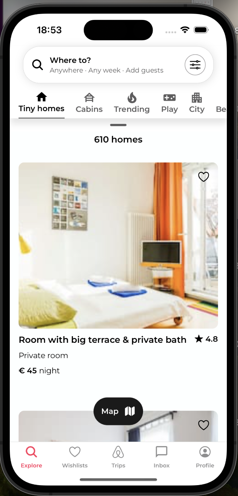
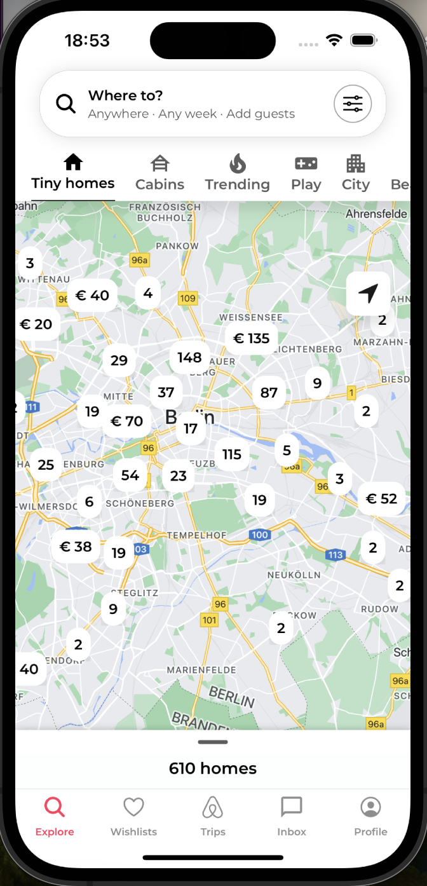
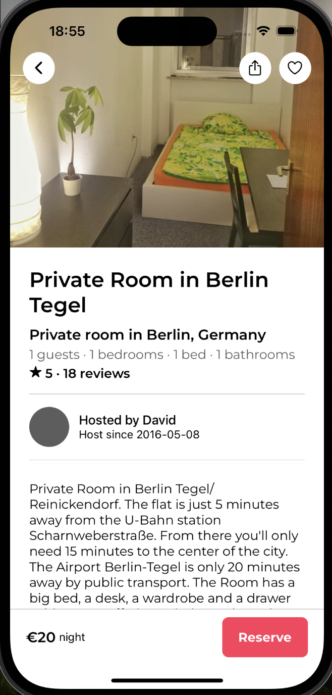
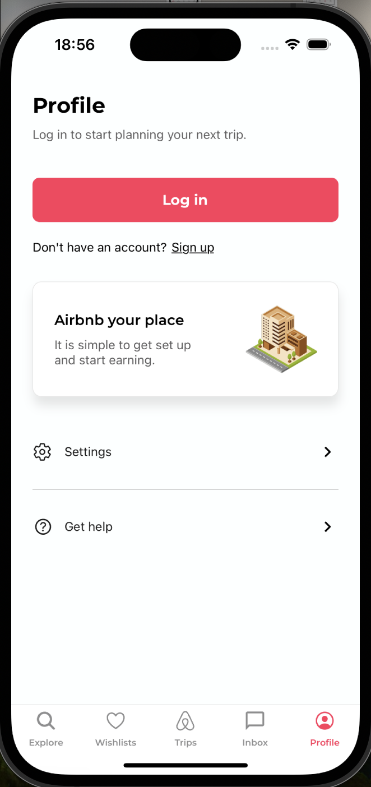
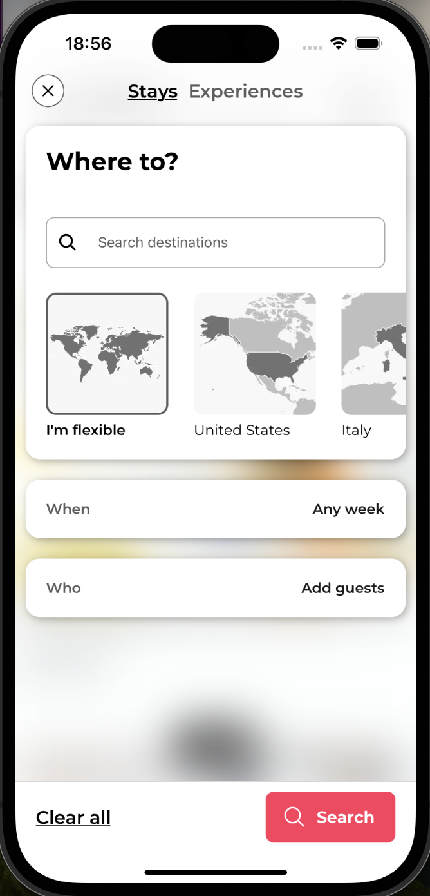

# Airbnb Clone App Template

This Airbnb Clone App Template is designed for developers aiming to build a vacation rental platform application. The template showcases essential features and interfaces, including property listings, map views, and detailed property descriptions. This template does not use real data and is meant for UI demonstration purposes.

## Features

- **Property Listings**: Browse through a variety of properties available for rent.
- **Map View**: Find properties using a map interface with location pins.
- **Property Details**: Each listing provides detailed information about the property, including price and ratings.
- **User Profiles**: View and manage user profiles for a personalized experience.
- **Favorites**: Users can save their favorite listings for quick access later.

## Getting Started

To begin with the Airbnb Clone App Template:

1. **Clone the Repository**: Obtain this project on your local machine via Git.
2. **Install Dependencies**: Execute `npm install` or `yarn install` to install all required dependencies.
3. **Launch the App**: Run `expo start` to start the app on your chosen platform using Expo Go, or create a build for iOS or Android.

## Usage

This app serves as a template and not a fully-fledged application. It's purposed to be a kick-off point for your development:

1. Browse different listings on the home screen.
2. Utilize the map view to discover properties by location.
3. Click on a listing to see more information.
4. Profile management for personalization and favorites.

## Screenshots

Take a look at some previews of the app:

## Demo Video

</a>

## Contributing

Contributions are welcome. Please feel free to fork the repository and submit your pull requests.

## Feedback

For feedback or suggestions regarding this template, please create an issue in the repository.
